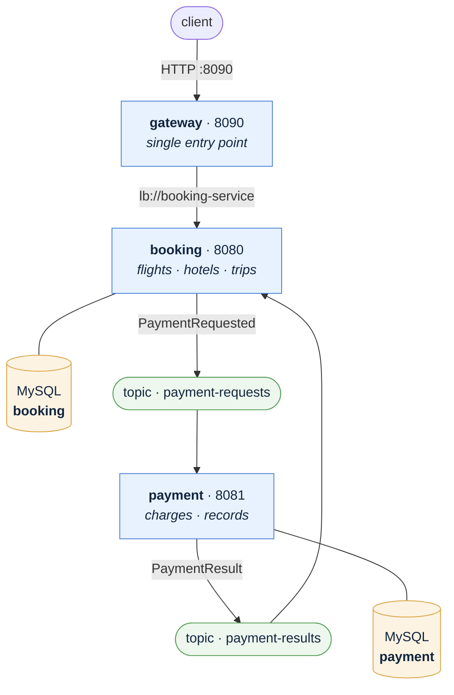

# Trip Booking Platform

A **Trip = one flight seat + one hotel room**, booked together as a single all-or-nothing operation.

    


## Key Features

- Built a microservices-based trip booking platform using **Java 17**, **Spring Boot 3**, **MySQL**, and **Apache Kafka**.
- Implemented **atomic flight + hotel booking**, ensuring either both the flight seat and hotel room are reserved or neither is.
- Used **optimistic locking** with `@Version` to prevent concurrent bookings for the same flight seat, returning **HTTP 409 Conflict** when a booking conflict occurs.
- Implemented payment processing using a **Kafka-based Saga pattern**, automatically releasing the reserved flight seat and hotel room when payment fails.
- Made the saga reliable end to end with a **transactional outbox** (no event can be lost between the DB commit and the Kafka send), **idempotent consumers** keyed on a unique `eventId`, and **retry + dead letter topics** so no failed message is dropped silently.
- Added **Spring Cloud Gateway** and **Netflix Eureka** for API routing and service discovery.
- Integrated **OpenTelemetry** with **Zipkin** for distributed tracing and observability.


## Tech stack

**Java 17** · **Spring Boot 3.5** · **Spring Cloud 2025.0** (Eureka, Gateway MVC) · **MySQL 8** with Spring Data JPA · **Apache Kafka**
· **Micrometer + OpenTelemetry → Zipkin** · **springdoc-openapi** · Maven multi-module


## Architecture

Four services. The client only ever talks to the gateway.



Not drawn, because every service touches them: **discovery** (`8761`) — each service registers with Eureka, so nothing is wired to a fixed `host:port` — and **Zipkin** (`9411`), where every service sends its traces.

| Service | Port | Database | What it does |
|---|---|---|---|
| discovery | 8761 | — | Eureka registry |
| gateway | 8090 | — | Single entry point; routes by service name |
| booking | 8080 | `booking` | Flights, hotels, trips, users |
| payment | 8081 | `payment` | Charges the trip, keeps its own records |

Each service owns its own database. Neither can read the other's tables.


## How a booking works

Booking and payment talk through two Kafka topics: `payment-requests` and `payment-results`.

```
POST /api/trips {seatId, roomId, userId}
   │
   │  booking-service, ONE transaction:
   │    1. reserve the seat and the room
   │    2. save the trip as PENDING
   │    3. write PaymentRequested to the outbox table
   │
   ◀── 202 Accepted (PENDING)
   │
   │  OutboxPublisher (every 1s): unsent rows ──▶ payment-service charges the card
   │                                                        │
        PaymentResult  ◀────────────────────────────────────┘
              │
              ├─ approved  →  trip CONFIRMED
              └─ declined  →  release seat + room, trip CANCELLED
```

Payment happens outside the booking transaction, so a slow charge never holds database rows open.


## API

Everything goes through the gateway on `:8090`. No auth — every path is open.

| Method | Path | Notes |
|---|---|---|
| GET | `/api/flights` · `/{id}` · `/{id}/seats` | |
| POST | `/api/flights` | creates a flight and its seats |
| GET | `/api/hotels` · `/{id}` · `/{id}/rooms` | |
| POST | `/api/hotels` | creates a hotel and its rooms |
| POST | `/api/trips` | book a trip — returns `202 PENDING` |
| GET | `/api/trips` · `?userId=` | all trips, or one user's |
| GET · POST | `/api/trips/{id}` · `/{id}/cancel` | |
| GET | `/api/payments/{id}` · `?tripReference=…` | |

Errors: `400` bad input · `404` not found · `409` seat or room already taken.

```bash
curl -X POST http://localhost:8090/api/trips \
  -H 'Content-Type: application/json' \
  -d '{"seatId":1,"roomId":1,"userId":2}'

curl http://localhost:8090/api/trips?userId=2
```


## Project structure

```
trip-booking-platform/       root pom
├── docker/                  Dockerfile per service + docker-compose.yml
├── discovery-service/       Eureka server
├── gateway-service/         routing only
├── booking-service/
│   └── com.jeysiva.booking
│       ├── user/    users (no passwords — a trip just holds a user id)
│       ├── flight/  flight → seats
│       ├── hotel/   hotel  → rooms
│       ├── trip/    trip = seat + room + user
│       ├── saga/    Kafka events, topics, result listener, error handler → DLT
│       │   ├── outbox/  events written with the booking, published on a timer
│       │   └── inbox/   processed event ids, so a redelivery is a no-op
│       └── common/  exceptions, error handler, OpenAPI, seeder
└── payment-service/         charges and payment records
```

Code is grouped by feature, not by layer — changing how trips book touches one folder, not five.


## Running it

With Docker (builds from source, nothing needed on the host):

```bash
docker compose -f docker/docker-compose.yml up --build
```

Gateway on `:8090`, Eureka on `:8761`, Zipkin on `:9411`. Booking and payment are not published on purpose.

By hand — needs JDK 17, MySQL 8, Kafka and Zipkin (`./kafka-up.sh`, `./zipkin-up.sh`). Start discovery first:

```bash
./mvnw test                                    # build + test everything

./mvnw -pl discovery-service spring-boot:run   # 8761
./mvnw -pl payment-service   spring-boot:run   # 8081
./mvnw -pl booking-service   spring-boot:run   # 8080
./mvnw -pl gateway-service   spring-boot:run   # 8090
```
